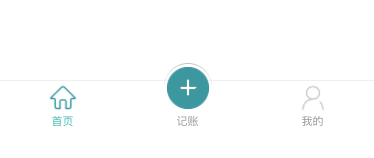

# mpvue-tabBar
一个mpvue 自定义小程序tabBar



## 安装

```bash
# 安装依赖
npm install

# 运行 mpvue
npm run run

```

## 步骤

### 1. 创建tabBar.vue组件

template 部分

```html
// template
<template>
  <div class="tabbar-wrap" :class="isIphoneX? 'isIphoneX':''">
      <ul class="tabbar">
          <li class="tabbar-item" v-for="(item, index) in navList" 
          :key="index" 
          @click="selectNavItem(index, item.pagePath)"
          :class="item.isSpecial ? 'wrapSpecial':''">
              <p class="tabbar-icon" >
                  
              </p>
              <p class="tabbar-text" :class="selectNavIndex == index? 'active':''">
                  {{item.text}}
              </p>
          </li>
      </ul>
  </div>
</template>
```

js 部分

```javascript
<script>
  export default {
    props: ['selectNavIndex'],
    data() {
      return {
        color: "#979795",
        selectedColor: "#45b7af",
        navList: [
          {
            pagePath: "/pages/index/main",
            iconPath: "/static/tabbar/icon_home.png",
            selectedIconPath: "/static/tabbar/icon_home_HL.png",
            text: "首页"
          },
          {
            pagePath: "/pages/index/main",
            iconPath: "/static/tabbar/icon_release.png",
            isSpecial: true,
            text: "记账"
          },
          {
            pagePath: "/pages/logs/main",
            iconPath: "/static/tabbar/icon_mine.png",
            selectedIconPath: "/static/tabbar/icon_mine_HL.png",
            text: "我的"
          }
        ],
      }
    },
    methods: {
      /**
       * 点击导航栏
       */
      selectNavItem(index, pagePath) {
        console.log(this.index)
        console.log(pagePath)

        if (index === this.selectNavIndex) {
          return false;
        }

        this.bindNavigateTo(pagePath);
      },

      /**
       * 路由跳转
       */
      bindNavigateTo(url) {
        wx.switchTab({
          url
        })
      },
    },
    computed: {
        isIphoneX(){
            return this.$store.getters.isIphoneX
        }
    }
  }
</script>
```

css 部分

```css
<style lang="stylus" scoped>
.tabbar-wrap 
    position fixed
    bottom 0
    left 0
    height 92px
    width 100%
    padding-top 6px
    box-shadow 0 0 2px #C4C4C4
    &.isIphoneX
        padding-bottom 66rpx
    .tabbar 
        display flex
        .tabbar-item
            flex 1  
            .tabbar-icon
                height 56px
                text-align center
                position relative
                img 
                    width 56px
                    height 56px
                    &.imgSpecial
                        width w = 84px
                        height h = 84px      
            .tabbar-text
                text-align center
                line-height 36px
                color #979795
                font-size 22px
                &.active
                    color #45b7af
            &.wrapSpecial
                .tabbar-icon
                    position absolute
                    top -36px
                    width 84px
                    height 84px
                    padding 6px
                    top -36px
                    left 50%
                    margin-left -((@width + @padding * 2 ) / 2)
                    border-radius 50%
                    border-top 2px solid #C4C4C4
                    text-align center
                .tabbar-text
                    position     relative
                    bottom -56px

</style>

```

引入自己的图片，默认路径在static/tabbar

### 2. 引入组件

在pages/index/index.vue中

```javascript
// 引入
import tabBar from '@/components/tabBar'

// 注册组件
components: {
    tabBar
},
```

```html
<!-- 使用组件 -->
<tab-bar :selectNavIndex="0"></tab-bar>
```

传参`selectNavIndex`表示当前页面下标

### 3. 配置app.json中的tabBar属性

app.json 对应小程序中的 app.json，是小程序的全局配置文件

由于使用`wx.switchTab`跳转，所以要在app.json中配置路径

```json
"list": [{
      "text": "首页",
      "pagePath": "pages/index/main",
      "iconPath": "static/tabbar/icon_home.png",
      "selectedIconPath": "static/tabbar/icon_home_HL.png"
    }, 
    {
      "text": "记账",
      "pagePath": "pages/index/main",
      "iconPath": "static/tabbar/icon_release.png",
      "selectedIconPath": "static/tabbar/icon_release.png"
    },
    {
      "text": "我的",
      "pagePath": "pages/logs/main",
      "iconPath": "static/tabbar/icon_mine.png",
      "selectedIconPath": "/tatic/tabbar/icon_mine_HL.png"
    }],
```

### 4. 禁用原生tabBar

在App.vue中调用禁用tabBar方法

```javascript
wx.hideTabBar()
```

### 5. 适配iphoneX

创建vuex，新建文件store/index.js

`actions` 中创建方法`getSystemInfo`异步调用`wx.getSystemInfo`获取系统信息保存在`state`中

```javascript
const Vue = require('vue')
const Vuex = require('vuex')

Vue.use(Vuex)

export default new Vuex.Store({
    state: {
        systemInfo: null
    },
    mutations: {
        ['GET_SYSTEMINFO_SUCCESS'](state, systemInfo) {
            state.systemInfo = systemInfo; 
        }
    },
    actions: {
        getSystemInfo({commit, state}){
            return new Promise((resolve, reject) => {
                console.log(state)
                if (state.systemInfo) {
                    resolve(state.systemInfo)
                } else {
                    wx.getSystemInfo({
                        success(res) {
                            commit('GET_SYSTEMINFO_SUCCESS', res)
                            resolve(res)
                        },
                        fail(err){
                            reject(err)
                        }
                    });
                }
                
            })
        },
    },
    getters: {
        isIphoneX: state => {
            return state.systemInfo ? state.systemInfo.model.includes("iPhone X") : false
        }
    }
})
```

在组件计算属性中添加

```javascript
computed: {
  isIphoneX(){
    return this.$store.getters.isIphoneX
  }
}
```

在`tempate`中添加，判断是否添加`isIphoneX`样式

```html
<div class="tabbar-wrap" :class="isIphoneX? 'isIphoneX':''">
```

### 其他

如果引入组件样式变大，可能是px转rpx比例的问题，需要在build/utils.js中修改配置:

```
var px2rpxLoader = {
    loader: 'px2rpx-loader',
    options: {
      baseDpr: 1,
      rpxUnit: 1
    }
  }
```


